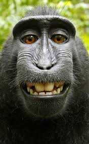
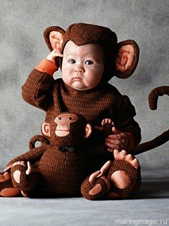
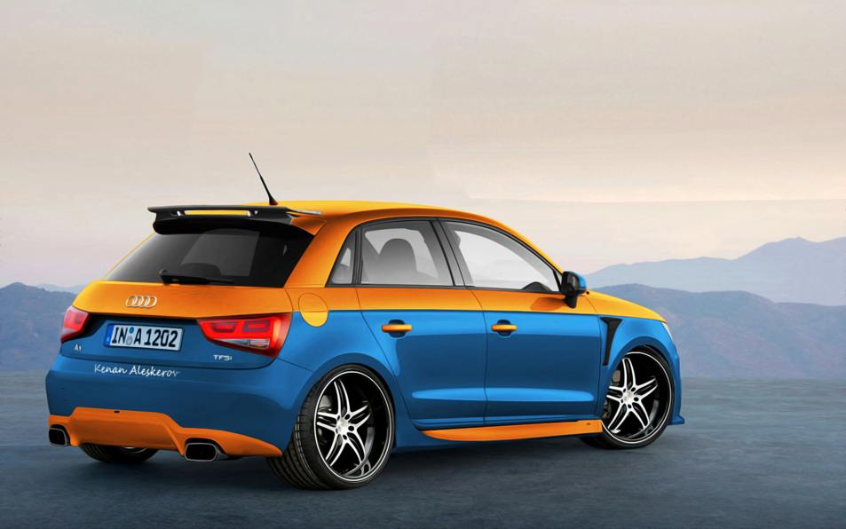

# Automatic photo collage
Automatic generete photo collage


Example of use

```css
.collage {
	width: 640px;
}
.collage img {
	display: block;
	float: left;
}
```

```html
<div class="collage">
	
	
	
	
	
	
	
	
	
	
</div>
```

```javascript
$('.collage').collage({
	maxHeight: 200,
	margin: 3
});
```

<a href="https://jsfiddle.net/v7sefrcw/8/" target="_blank">demo page</a>
